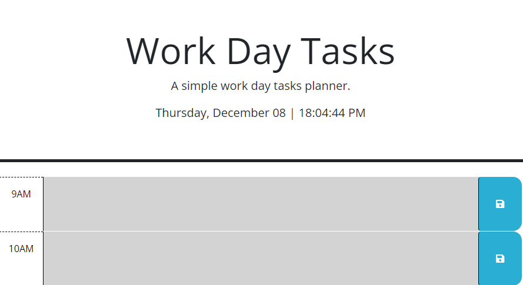

# work-task

[Link to my project](https://github.com/Deiontre10/work-task)

## Table of Contents
- [Description](#description)
- [Visuals](#visuals)

## Description
Work Day Tasks helps you manage your daily tasks and schedule them into different time slots. You can assign each task to any time slot and save them. Then, you can easily see what you have to do next and when it needs to be done.

Product Features: 
- Assign tasks to different times.

- Save the tasks for later use even if you close the site.

## Visuals

